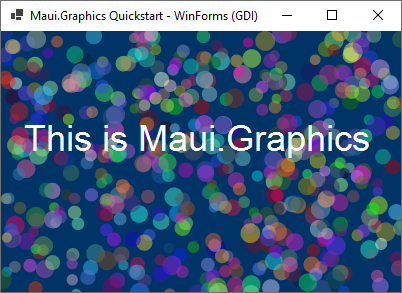

# Maui.Graphics WinForms Quickstart

This page demonstrates how to use Maui.Graphics in a Windows Forms application. 

<div class='text-center img-border'>



</div>

## Steps

> **WARNING:** At the time of writing Microsoft.Maui.Graphics is still in pre-release and the WinForms control is not available as a NuGet package. This is likely to get easier in the future.

* Create a WinForms application
* Add NuGet package
  * [Microsoft.Maui.Graphics](https://www.nuget.org/packages/Microsoft.Maui.Graphics)
* Add WinForms control package from source
  * [Microsoft.Maui.Graphics.GDI.WinForms](https://github.com/dotnet/Microsoft.Maui.Graphics/tree/main/src/Microsoft.Maui.Graphics.GDI.Winforms) (it's not on NuGet yet)
* Create a `Drawable` that describes what you want to render
* Place a `GDIGraphicsView` in your layout
* Create a `Drawable` and assign it to the `GDIGraphicsView`
* Add a `Loaded` event to invalidate the control (forcing a render at launch)

## MyDrawable.cs
```cs
using Microsoft.Maui.Graphics;

public class MyDrawable : IDrawable
{
    private readonly Random Rand = new();

    public void Draw(ICanvas canvas, RectangleF dirtyRect)
    {
        canvas.FillColor = Color.FromArgb("#003366");
        canvas.FillRectangle(dirtyRect);

        for (int i = 0; i < 500; i++)
        {
            canvas.FillColor = Color.FromRgba(
                r: Rand.NextDouble(),
                g: Rand.NextDouble(),
                b: Rand.NextDouble(),
                a: .5);

            canvas.FillCircle(
                centerX: (float)Rand.NextDouble() * dirtyRect.Width,
                centerY: (float)Rand.NextDouble() * dirtyRect.Height,
                radius: (float)Rand.NextDouble() * 5 + 5);
        }

        canvas.FontSize = 36;
        canvas.FontColor = Colors.White;
        canvas.SetShadow(
            offset: new SizeF(2, 2),
            blur: 1,
            color: Colors.Black);

        canvas.DrawString(
            value: "This is Maui.Graphics",
            x: dirtyRect.Width / 2,
            y: dirtyRect.Height / 2,
            horizontalAlignment: HorizontalAlignment.Center);
    }
}
```

## Form1.cs

* 💡 Invaliding the control after the size changes forces the whole window to redraw

```cs
public partial class Form1 : Form
{
    public Form1()
    {
        InitializeComponent();
        gdiGraphicsView1.Drawable = new GraphicsModels.RandomCircles();
        gdiGraphicsView1.SizeChanged += (_, _) => gdiGraphicsView1.Invalidate();
    }
}
```

## Source Code

* https://github.com/swharden/Maui.Graphics/tree/main/projects

## Resources
* https://maui.graphics
* [Drawing with Maui.Graphics](https://swharden.com/blog/2021-09-10-maui-graphics)
* [Microsoft.Maui.Graphics](https://github.com/dotnet/Microsoft.Maui.Graphics) project on GitHub