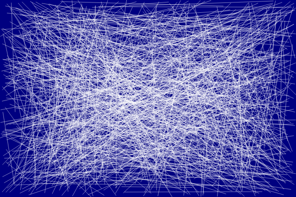

This page describes how to draw using Maui.Graphics from a console application and save the output as an image file.

> **⚠️ Warning:** The Maui.Graphics package is currently in preview and its API may change as the library matures.

#### 1. Create a Console Application

```
dotnet new console
```

#### 2. Add Maui.Graphics Packages

* [`Microsoft.Maui.Graphics`](https://www.nuget.org/packages/Microsoft.Maui.Graphics)
* [`Microsoft.Maui.Graphics.Skia`](https://www.nuget.org/packages/Microsoft.Maui.Graphics.Skia/6.0.200-preview.13.935)

```
dotnet add package Microsoft.Maui.Graphics --prerelease
dotnet add package Microsoft.Maui.Graphics.Skia --prerelease
```

#### 3. Draw Graphics

Create a bitmap export context, interact with its canvas, then save the output as an image file:

```cs
using Microsoft.Maui.Graphics; // 6.0.200-preview.13.935
using Microsoft.Maui.Graphics.Skia; // 6.0.200-preview.13.935

BitmapExportContext bmp = SkiaGraphicsService.Instance.CreateBitmapExportContext(600, 400);
SizeF bmpSize = new(bmp.Width, bmp.Height);
ICanvas canvas = bmp.Canvas;

canvas.FillColor = Colors.Navy;
canvas.FillRectangle(0, 0, bmpSize.Width, bmpSize.Height);

Random rand = new(0);
for (int i = 0; i < 1000; i++)
{
    canvas.StrokeColor = Colors.White.WithAlpha(.5f);
    canvas.DrawLine(
        x1: (float)rand.NextDouble() * bmpSize.Width,
        y1: (float)rand.NextDouble() * bmpSize.Height,
        x2: (float)rand.NextDouble() * bmpSize.Width,
        y2: (float)rand.NextDouble() * bmpSize.Height);
}

bmp.WriteToFile("console.png");
```

### Output

<div class="text-center">



</div>

## Resources

* [Download the source code for this project](https://github.com/swharden/Maui.Graphics/tree/main/projects)